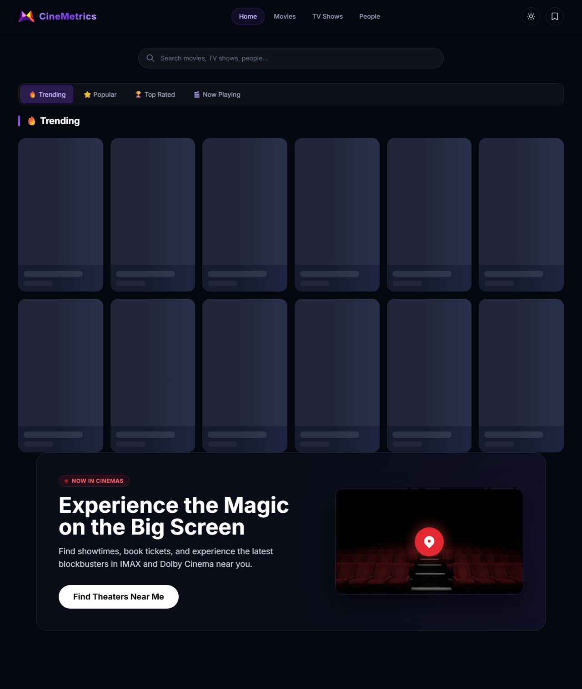

# CineMetrics 🎬

<div align="center">


**A premium movie & TV discovery platform built with React 19 + Vite + Tailwind CSS v4**

[](https://react.dev/)
[](https://vitejs.dev/)
[](https://tanstack.com/query)
[](https://tailwindcss.com/)
[](https://www.framer.com/motion/)

</div>

---

## ✨ Features

- **🎯 Cinematic Hero Banner** — Auto-rotating carousel with full-bleed backdrops, Framer Motion transitions, and dot navigation
- **🎬 Movies & TV Shows** — Dedicated pages with Popular / Top Rated / Now Playing tabs and infinite scroll
- **👥 People** — Browse popular actors and directors with infinite scroll
- **🔍 Smart Search** — Debounced input with URL sync, autocomplete suggestions dropdown, and keyboard navigation
- **🎛️ Advanced Filters** — Genre (cached via TanStack Query), Sort By, Year range, Rating, Runtime
- **📋 Watchlist** — 3 categories (Plan to Watch / Watching / Completed), star ratings, personal notes, export/import JSON
- **🕐 Recently Viewed** — Tracks last 20 visited movies/shows, shown as a "Continue Watching" row
- **📱 Mobile-first** — Bottom navigation bar on mobile, hamburger menu, responsive grid
- **⚡ TanStack Query** — Smart caching (5-min stale, 10-min GC), infinite pagination, no duplicate fetches
- **🌐 SEO-ready** — react-helmet-async for per-page titles, descriptions, and Open Graph tags
- **🚀 Lazy Loading** — All pages code-split via React Suspense
- **👤 Person Detail Pages** — Full biographies, known-for filmographies, and dynamic fallback avatars (ui-avatars) for missing profile images

---

## 🖥️ Screenshots

| Home (Hero Banner) | Movies Page |
|---|---|
|  | Grid with tabs, filters, and infinite scroll |
| Cinematic full-bleed hero with rating badges | |

---

## 🗂️ Project Structure

```
src/
├── api/              # TMDB API functions (movies, tv, people, client)
├── components/
│   ├── filters/      # FilterBar, SearchBar, Tabs
│   ├── layout/       # Navbar, MobileNav
│   ├── media/        # HeroBanner, MediaCard, MediaGrid
│   └── ui/           # Spinner, SkeletonCard
├── context/          # ThemeContext, WatchlistContext
├── hooks/            # useDebounce, useInfiniteScroll, useLocalStorage, useRecentlyViewed, useWatchlist
├── lib/              # queryClient.js, utils.js
└── pages/            # Home, Movies, TVShows, People, MovieDetail, TVDetail, Watchlist, GenrePage, NotFound
```

---

## 🚀 Getting Started

### Prerequisites
- Node.js 18+
- A free [TMDB API key](https://www.themoviedb.org/settings/api)

### Setup

```bash
# Clone the repo
git clone https://github.com/your-username/cinemetrics.git
cd cinemetrics

# Install dependencies
npm install

# Create environment file
echo "VITE_TMDB_API_KEY=your_api_key_here" > .env.local

# Start development server
npm run dev
```

The app will be running at `http://localhost:5173`.

---

## 🔧 Environment Variables

| Variable | Description |
|---|---|
| `VITE_TMDB_API_KEY` | Your TMDB API Read Access Token (Bearer token) |

---

## 🛠️ Tech Stack

| Technology | Purpose |
|---|---|
| React 19 | UI framework |
| Vite 7 | Build tool & dev server |
| Tailwind CSS v4 | Styling with custom design tokens |
| TanStack Query v5 | Server state & caching |
| Framer Motion | Animations & transitions |
| React Router v7 | Client-side routing |
| react-helmet-async | SEO meta tags |
| react-intersection-observer | Infinite scroll |
| TMDB API | Movie & TV data |

---

## 🛣️ Routes

| Route | Page |
|---|---|
| `/` | Home — hero banner + discovery |
| `/movies` | Browse all movies |
| `/tv` | Browse TV shows |
| `/people` | Popular actors & directors |
| `/movie/:id` | Movie detail page |
| `/tv/:id` | TV show detail page |
| `/watchlist` | Personal watchlist |
| `/genre/:id/:name` | Genre-specific browse |
| `*` | 404 Not Found |

---

## 📋 Roadmap

- `[x]` Dark/Light theme toggle
- `[x]` Person detail page (biography, filmography)
- `[x]` PWA support (offline capability)
- `[x]` Collection/franchise support
- `[ ]` Advanced recommendations algorithm

---

## 📄 License

MIT License — feel free to use, fork, and build upon this project.
